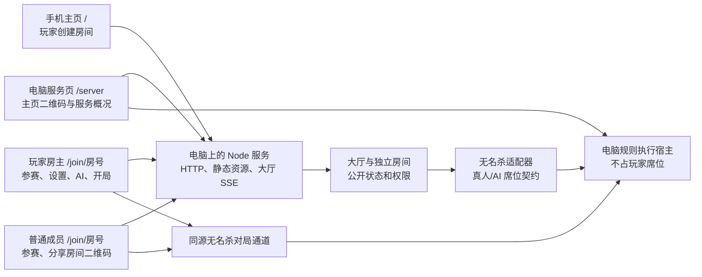

# 架构与决策

## 部署与职责

大厅与真实对局已接通。电脑页面不承担产品房主职责。手机房主是普通参赛席位加房间管理权限，不自动等同于引擎规则宿主。

## ADR-001：局域网电脑服务与规则宿主

状态：v0.3.0 已正式接入四模式。

电脑提供局域网服务、展示主页二维码，整局保持页面开启。无名杀上游联机包主要转发客户端消息，不能视为 Node 中的完整规则服务器。本项目由电脑浏览器承载规则，Node 提供静态资源与认证联机转发。

无名杀原生 host/`game.me` 默认占据席位。正式适配使用脱离席位的原生 Player 作为规则视角，禁用它的玩家计时器广播；所有实际席位绑定手机客户端或原生 AI。玩家房主的公共管理权限由本项目的房间会话决定，不交给电脑 host 身份决定。每个 match 有独立 iframe、套接字集合和状态；可支持的并发房间数量仍需实测。

`packages/noname-adapter/lab` 保留独立研究与回归，不被大厅或双击启动器引用。其测试角色参数只用于固定测试身份，不能复制其无授权端点用于聚会服务；正式 `runtime` 已实施大厅会话认证和接收者过滤。

## ADR-002：大厅与引擎分离

状态：大厅、契约与正式原生对局已实现。

`LobbyStore` 管理房间索引、会话所在房间和公开摘要；`RoomStore` 管理单间公开席位、设置、准备、玩家房主、AI 席位与状态。房间由玩家创建，不在服务启动时预创建。

`EngineAdapter.start` 接收 `roomCode`、`ownerPlayerId`、配置、带 `human/bot` 类型的席位和固定 `aiPolicy: strongest-native`。正式适配器把此配置交给浏览器规则宿主，AI 运行上游完整决策。启动必须得到真实选将和发牌确认，状态才从 `waiting → starting → playing` 转换；失败回到 `waiting`。

正式入口 `main.ts` 使用 `NativeNonameService`，资源校验通过且电脑服务页心跳在线才 ready；默认不配置引擎的测试服务器仍使用 `NonameAdapter` 占位器。不得用 mock、随机操作或广播成功替代真实无名杀完成选将和发牌的确认。

## ADR-003：协议、页面和模块

状态：已实现。

Node.js 24、TypeScript、原生 HTTP/DOM、esbuild、本机生成二维码。大厅用 HTTP 修改状态、SSE 广播公共快照；无名杀动作和私有状态使用独立认证 WebSocket。

| 路径                          | 模块职责                                         |
| ----------------------------- | ------------------------------------------------ |
| `apps/server/src/main.ts`     | 环境配置、监听、运行会话信息                     |
| `apps/server/src/server.ts`   | HTTP/SSE、cookie、二维码、静态文件、本机停止协议 |
| `apps/server/src/lobby.ts`    | 多房间索引、创建、加入、成员所在房间、摘要       |
| `apps/server/src/room.ts`     | 单间房主、真人/AI 席位、准备、模式、启动状态机   |
| `apps/web/src/main.ts`        | 页面路由与初始请求                               |
| `apps/web/src/lobby-page.ts`  | 电脑服务页和玩家主页                             |
| `apps/web/src/room-page.ts`   | 手机房间、根据玩家身份显示控制                   |
| `apps/web/src/ui.ts`、`qr.ts` | 公共请求、反馈、SSE、二维码组件                  |
| `packages/shared`             | 跨端类型、公开协议和枚举                         |
| `packages/noname-adapter`     | 真实引擎和原生 AI 的接入边界                     |

页面依据 `session.playerId === room.ownerId` 判断房主。HTTP 响应晚于 SSE 时用单间 `revision` 防止旧状态回退；创建/加入后先更新本地会话，再连接 SSE。

## ADR-004：会话与房间权限

状态：大厅已实现；替代 v0.1.0 的电脑房主能力链接方案。

真人席位使用随机 HttpOnly、SameSite cookie 和独立公开 ID。服务端在单间房间内验证 token 对应的真人 ID 是否等于 `ownerId`，设置、移人、添加 AI、开局都必须通过此检查。公开二维码与快照不包含 token。一个浏览器会话同一时间只占一个房间。

所有已入座真人都能请求本房间二维码。电脑主页二维码只含 `/`，成员二维码只含 `/join/房号`；生成服务只接受本机实际宣告的地址。旧 `/host` 路径跳转 `/server`，旧 fragment 不兑换权限。

SSE 连接数支持同一玩家多个标签，最后一个连接断开标记离线并撤销准备，保留席位和房主。房主显式离开，按入座顺序将权限交给下一位真人；最后真人离开使房间 `closed`，清空 AI 并从大厅移除。移除席位后，旧 SSE 清理不会改变已移交的房间状态。

当前不支持微信与系统浏览器之间切换会话。真实对局绑定相同大厅 cookie，同浏览器刷新恢复座位；私有状态分发与卡牌引用保护集中在适配包中。

## ADR-005：AI 补位与准备

状态：席位管理与完整原生 AI 已接入。

总席位包含真人和 AI。AI 没有玩家 cookie 或人工准备权限，不做房主。AI 自动准备，房主可逐个添加、一键补满、按席位移除；缩小配置只裁掉多余 AI，真人超额时拒绝修改。

模式、武将或成员构成发生变化都会撤销真人准备。开始后锁定增加 AI、移人、离开、配置和重复开始。原生 AI 固定使用最强可用完整决策，不提供难度选择。`difficulty` 在候选源码中是态度配置，不能简单设成 `hard` 后声称提高了智力；见 `engine-investigation.md` 与 `config/ai-policy.json`。

## ADR-006：Windows 双击启动与本机管理

状态：源码版与 Windows x64 离线发行包均已实现。

根目录 `.cmd` 调用 `scripts/launch.ps1` 寻找本机或 `.local/runtime/node.exe` 的 Node，再执行 `scripts/launcher.mjs`。无需用户输入命令；首次缺依赖时安装锁定依赖，构建页面后隐藏启动后台 Node 并打开 `/server`。启动器使用 `.runtime/launcher.lock` 防止重复启动竞争；失效锁根据进程是否存在清理。

实例通过 `.runtime/session.json` 的应用 ID、版本、随机 `instanceId` 和本机健康接口验证，重复启动复用实例。先检查本机回环端口，再监听；Windows 可允许不同地址的绑定交叠，仅依赖 `listen` 失败会误开其他程序页面。双击启动遇到端口冲突时最多尝试后续 20 个端口；显式 `PUBLIC_URL` 时不自动改端口。前台 `npm start` 保持显式端口语义。启动等待失败时只清理本次刚创建的后台进程。

停止由本机脚本读取当前实例凭据，向回环 `/api/shutdown` 发请求。服务同时校验回环来源与随机控制凭据，然后结束 SSE 和 HTTP。该凭据只存在本机运行文件，不是房主权限，不通过二维码、主页、API 或日志公开。不按端口、进程名或所有 Node 进程批量终止。

## ADR-007：上游、扩展和数据生命周期

状态：基线引擎已接入，扩展仍为空目录。

上游下载放 `.local`，固定 tag、commit、校验值；本项目源码、适配补丁和扩展源代码与上游隔离。第三方保留来源与许可证，不自动升级。`config/noname-candidate.json` 记录当前运行基线与验证范围，武将白名单由正式适配读取并生效。

扩展目录当前为空；联机、武将范围与运行兼容验证通过才开放。真实对局不能热替换扩展或规则。未来每个扩展保留 manifest、版本、来源、资源和模式兼容说明。

大厅与席位存内存，重启清空。`.runtime/session.json` 是本机进程信息，不是游戏存档；旧房间邀请重启后失效。`.local`、`.runtime`、`dist` 均忽略，不提交运行凭据、第三方大资源、依赖和截图。

## ADR-008：浏览器规则执行与正式联机

状态：v0.3.0 已实现，详见 `packages/noname-adapter/runtime/README.md`。

每个 match 在电脑服务页的独立 iframe 中运行原生引擎，规则宿主的 Player 视点脱离所有参赛数组。玩家原生 UI 也在房间 iframe 内运行，外层 SSE 保持在线、二维码和房主身份。`starting` 包含选将；真实发牌完成才 `playing`。原生胜负到 `finished`，房主回房后释放旧 worker，生成新 match 再开局。

仅回环 `/engine/jobs` 发放 HttpOnly 宿主 cookie；宿主与玩家套接字都验证 Origin。玩家连接按大厅 cookie 绑定真实席位，忽略原生 init 中自报的 ID。白名单拒绝原生配置、开局、牌堆读取与任意函数执行；物理牌引用只解析现有 ID，防止客户端改写牌值。源昵称只通过 textContent 显示。

`/engine/core` 只读映射固定引擎根目录，拒绝越界、写入和工作区文件；绝对模块路径与旧文件接口在响应中改到引擎命名空间，上游磁盘源码不改。原生事件需要 eval 与动态样式，宽松 CSP 只用于引擎路径，主大厅保留严格 CSP。所有资源同源，普通局域网 HTTP 不运行 TypeScript/Service Worker 入口。

`privacy.js` 在接收方序列化上下文中过滤暗牌值、身份与重连快照，并再次检查提前编码的事件父链与原始卡牌元组。公开牌和原生技能允许知晓的牌保留；仅 UI 遮盖不是权限边界。新增技能私有 storage、恶意决策全面合法性、防作弊和并发容量不能由这次基础验证推导为已完成。
