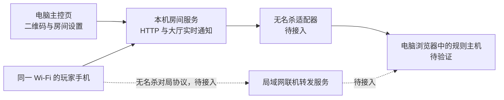

# 架构与决策

## 部署结构

实线为当前大厅实现，虚线为计划接入的对局通道。最终玩家仍通过本机同一服务获取页面和资源。

## ADR-001：局域网部署与常驻电脑主控

状态：产品部署方向已确认，对局执行方式尚待验证。

用户已接受电脑整局保持页面开启并显示二维码。无名杀候选联机服务主要转发客户端消息，不能直接视为 Node.js 中运行的完整三国杀规则服务器。首选验证电脑浏览器承载规则、Node 提供静态资源及联机转发的路径。

普通房主浏览器会占用一个席位，需要专门验证或适配电脑不参赛的行为。适配失败时重新评估公开版本或维护最小上游补丁。不得把 8 人需求改成“电脑加 7 部手机”。

## ADR-002：可运行大厅与引擎适配分离

状态：已实现。

首个可独立验证的组件是扫码、昵称、席位、准备、模式/武将档设置。它不保存或运行卡牌规则。引擎接口集中在 `packages/noname-adapter`；前后端通过 `packages/shared` 共享大厅数据。

`EngineAdapter.start` 只有在引擎完成真实房间、模式、武将和客户端准备后才能成功。大厅通过 `waiting → starting → playing` 转换；启动失败回到 `waiting`。当前 `NonameAdapter` 明确报告未就绪，禁止开局。

## ADR-003：技术底座与实时通知

状态：已实现，可随复杂度调整。

使用 Node.js 24、TypeScript、原生 HTTP 服务、原生 DOM 页面和 esbuild 构建。扫码大厅规模小，使用 HTTP 请求修改状态、SSE 广播公开房间快照，减少部署组件。所有脚本、样式及二维码由电脑本机提供。

SSE 只服务大厅。无名杀的 WebSocket 协议、行动请求、超时和重连留在适配器，不将它们改写成大厅 SSE 协议。增加复杂 UI 时再决定是否引入框架。

## ADR-004：会话与权限

状态：大厅部分已实现。

服务启动生成随机房主能力链接，能力值位于 URL fragment，换取 HttpOnly、SameSite cookie 后立即移除 fragment。玩家二维码和公开 API 不携带房主能力。所有设置、移人和开局接口均校验房主会话。

玩家席位使用独立随机 cookie 与公开 player ID。普通快照仅包含昵称、在线/准备状态、房间设置。SSE 连接数支持同一玩家多个标签，最后一个连接关闭时标为离线并取消准备。

当前是熟人局域网部署，不提供互联网开放服务器。引擎接入时仍需单独落实玩家与引擎席位的绑定、私有状态分发和动作权限。

## ADR-005：上游、武将和扩展管理

状态：边界已建立，运行集成待完成。

上游下载放在 `.local`，固定 tag、commit、校验值并记录来源。不将大型游戏资产、依赖、临时截图或房主能力链接提交到 Git。不在引擎目录内散落本项目源码。

`config/noname-candidate.json` 表示研究候选，不表示已选定可发布的运行版本。武将范围在 `roster-presets.json` 管理；整包和指定分组、白名单分别表达。扩展目录保持空列表，适配器完成一致性和联机验证后才允许开放。

运行中的房间和扩展变更需要版本一致，开局后不能热替换规则；扩展源码未来集中在 `extensions/<id>`，保留 manifest、版本、来源、资源和模式兼容性说明。

## 当前数据生命周期

房间与席位保存在内存，重启即清空。`.runtime/session.json` 是当前本机启动信息，不是游戏存档。浏览器 cookie 用于同一次服务生命周期内恢复席位，不能承诺恢复重启前的真实对局。
