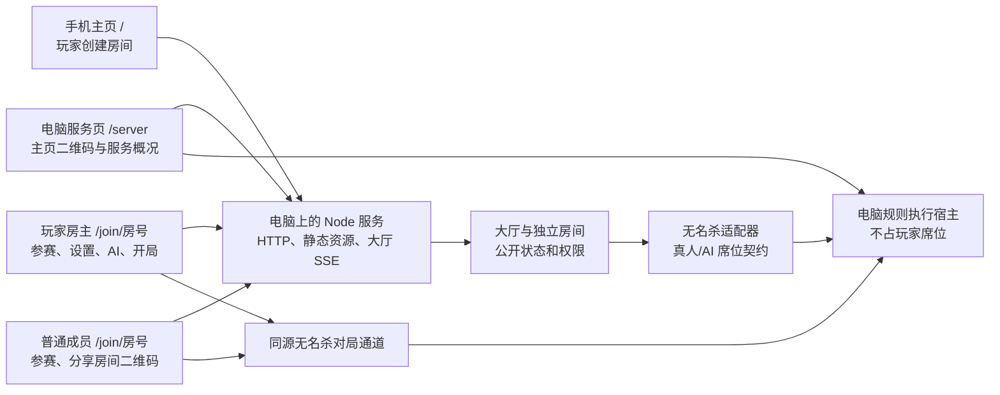

# 架构与决策

## 部署与职责

大厅与真实对局已接通。电脑页面不承担产品房主职责。手机房主是普通参赛席位加房间管理权限，不自动等同于引擎规则宿主。

v0.5.0 的 `/server` 同时提供独立本机运维权限和公开观战，边界见 ADR-015/016；不把本机运维 cookie 用于手机房主 API。

## ADR-001：局域网电脑服务与规则宿主

状态：v0.3.0 已正式接入四模式。

v0.4.0 保留电脑规则宿主，默认入口改为临时公网，连接方案见 ADR-011；局域网作为明确的备用模式。

电脑提供局域网服务、展示主页二维码，整局保持页面开启。无名杀上游联机包主要转发客户端消息，不能视为 Node 中的完整规则服务器。本项目由电脑浏览器承载规则，Node 提供静态资源与认证联机转发。

无名杀原生 host/`game.me` 默认占据席位。正式适配使用脱离席位的原生 Player 作为规则视角，禁用它的玩家计时器广播；所有实际席位绑定手机客户端或原生 AI。玩家房主的公共管理权限由本项目的房间会话决定，不交给电脑 host 身份决定。每个 match 有独立 iframe、套接字集合和状态；可支持的并发房间数量仍需实测。

`packages/noname-adapter/lab` 保留独立研究与回归，不被大厅或双击启动器引用。其测试角色参数只用于固定测试身份，不能复制其无授权端点用于聚会服务；正式 `runtime` 已实施大厅会话认证和接收者过滤。

## ADR-002：大厅与引擎分离

状态：大厅、契约与正式原生对局已实现。

`LobbyStore` 管理房间索引、会话所在房间和公开摘要；`RoomStore` 管理单间公开席位、设置、准备、玩家房主、AI 席位与状态。房间由玩家创建，不在服务启动时预创建。

`EngineAdapter.start` 接收 `roomCode`、`ownerPlayerId`、配置、带 `human/bot` 类型的席位和固定 `aiPolicy: strongest-native`。正式适配器把此配置交给浏览器规则宿主，AI 运行上游完整决策。启动必须得到真实选将和发牌确认，状态才从 `waiting → starting → playing` 转换；失败回到 `waiting`。

正式入口 `main.ts` 使用 `NativeNonameService`，资源校验通过且电脑服务页心跳在线才 ready；默认不配置引擎的测试服务器仍使用 `NonameAdapter` 占位器。不得用 mock、随机操作或广播成功替代真实无名杀完成选将和发牌的确认。

## ADR-003：协议、页面和模块

状态：已实现。

Node.js 24、TypeScript、原生 HTTP/DOM、esbuild、本机生成二维码。大厅用 HTTP 修改状态、SSE 广播公共快照；无名杀动作和私有状态使用独立认证 WebSocket。

| 路径                          | 模块职责                                         |
| ----------------------------- | ------------------------------------------------ |
| `apps/server/src/main.ts`     | 环境配置、监听、运行会话信息                     |
| `apps/server/src/server.ts`   | HTTP/SSE、cookie、二维码、静态文件、本机停止协议 |
| `apps/server/src/lobby.ts`    | 多房间索引、创建、加入、成员所在房间、摘要       |
| `apps/server/src/room.ts`     | 单间房主、真人/AI 席位、准备、模式、启动状态机   |
| `apps/web/src/main.ts`        | 页面路由与初始请求                               |
| `apps/web/src/lobby-page.ts`  | 电脑服务页和玩家主页                             |
| `apps/web/src/room-page.ts`   | 手机房间、根据玩家身份显示控制                   |
| `apps/web/src/ui.ts`、`qr.ts` | 公共请求、反馈、SSE、二维码组件                  |
| `packages/shared`             | 跨端类型、公开协议和枚举                         |
| `packages/noname-adapter`     | 真实引擎和原生 AI 的接入边界                     |

页面依据 `session.playerId === room.ownerId` 判断房主。HTTP 响应晚于 SSE 时用单间 `revision` 防止旧状态回退；创建/加入后先更新本地会话，再连接 SSE。

## ADR-004：会话与房间权限

状态：大厅已实现；替代 v0.1.0 的电脑房主能力链接方案。

真人席位使用随机 HttpOnly、SameSite cookie 和独立公开 ID。服务端在单间房间内验证 token 对应的真人 ID 是否等于 `ownerId`，设置、移人、添加 AI、开局都必须通过此检查。公开二维码与快照不包含 token。一个浏览器会话同一时间只占一个房间。

所有已入座真人都能请求本房间二维码。电脑主页二维码只含 `/`，成员二维码只含 `/join/房号`；生成服务只接受本机实际宣告的地址。旧 `/host` 路径跳转 `/server`，旧 fragment 不兑换权限。

SSE 连接数支持同一玩家多个标签，最后一个连接断开标记离线并撤销准备，保留席位和房主。房主显式离开，按入座顺序将权限交给下一位真人；最后真人离开使房间 `closed`，清空 AI 并从大厅移除。移除席位后，旧 SSE 清理不会改变已移交的房间状态。

当前不支持微信与系统浏览器之间切换会话。真实对局绑定相同大厅 cookie，同浏览器刷新恢复座位；私有状态分发与卡牌引用保护集中在适配包中。

## ADR-005：AI 补位与准备

状态：席位管理与完整原生 AI 已接入。

总席位包含真人和 AI。AI 没有玩家 cookie 或人工准备权限，不做房主。AI 自动准备，房主可逐个添加、一键补满、按席位移除；缩小配置只裁掉多余 AI，真人超额时拒绝修改。

模式、武将或成员构成发生变化都会撤销真人准备。开始后锁定增加 AI、移人、离开、配置和重复开始。原生 AI 固定使用最强可用完整决策，不提供难度选择。`difficulty` 在候选源码中是态度配置，不能简单设成 `hard` 后声称提高了智力；见 `engine-investigation.md` 与 `config/ai-policy.json`。

## ADR-006：Windows 双击启动与本机管理

状态：源码版与 Windows x64 离线发行包均已实现。

根目录 `.cmd` 调用 `scripts/launch.ps1` 寻找本机或 `.local/runtime/node.exe` 的 Node，再执行 `scripts/launcher.mjs`。无需用户输入命令；首次缺依赖时安装锁定依赖，构建页面后隐藏启动后台 Node 并打开 `/server`。启动器使用 `.runtime/launcher.lock` 防止重复启动竞争；失效锁根据进程是否存在清理。

实例通过 `.runtime/session.json` 的应用 ID、版本、随机 `instanceId` 和本机健康接口验证，重复启动复用实例。先检查本机回环端口，再监听；Windows 可允许不同地址的绑定交叠，仅依赖 `listen` 失败会误开其他程序页面。双击启动遇到端口冲突时最多尝试后续 20 个端口；显式 `PUBLIC_URL` 时不自动改端口。前台 `npm start` 保持显式端口语义。启动等待失败时只清理本次刚创建的后台进程。

停止由本机脚本读取当前实例凭据，向回环 `/api/shutdown` 发请求。服务同时校验回环来源与随机控制凭据，然后结束 SSE 和 HTTP。该凭据只存在本机运行文件，不是房主权限，不通过二维码、主页、API 或日志公开。不按端口、进程名或所有 Node 进程批量终止。

## ADR-007：上游、扩展和数据生命周期

状态：基线引擎已接入，扩展仍为空目录。

上游下载放 `.local`，固定 tag、commit、校验值；本项目源码、适配补丁和扩展源代码与上游隔离。第三方保留来源与许可证，不自动升级。`config/noname-candidate.json` 记录当前运行基线与验证范围，武将白名单由正式适配读取并生效。

扩展目录当前为空；联机、武将范围与运行兼容验证通过才开放。真实对局不能热替换扩展或规则。未来每个扩展保留 manifest、版本、来源、资源和模式兼容说明。

大厅与席位存内存，重启清空。`.runtime/session.json` 是本机进程信息，不是游戏存档；旧房间邀请重启后失效。`.local`、`.runtime`、`dist` 均忽略，不提交运行凭据、第三方大资源、依赖和截图。

## ADR-008：浏览器规则执行与正式联机

状态：v0.3.0 已实现，详见 `packages/noname-adapter/runtime/README.md`。

每个 match 在电脑服务页的独立 iframe 中运行原生引擎，规则宿主的 Player 视点脱离所有参赛数组。玩家原生 UI 也在房间 iframe 内运行，外层 SSE 保持在线、二维码和房主身份。`starting` 包含选将；真实发牌完成才 `playing`。原生胜负到 `finished`，房主回房后释放旧 worker，生成新 match 再开局。

仅回环 `/engine/jobs` 发放 HttpOnly 宿主 cookie；宿主与玩家套接字都验证 Origin。玩家连接按大厅 cookie 绑定真实席位，忽略原生 init 中自报的 ID。白名单拒绝原生配置、开局、牌堆读取与任意函数执行；物理牌引用只解析现有 ID，防止客户端改写牌值。源昵称只通过 textContent 显示。

电脑通过仅本机的 `/engine/jobs?transport=events` 接收任务推送；任务创建、状态变化与释放立即更新 iframe，服务器每 8 秒推送并保活宿主。此连接不经过公网代理。旧服务器不支持事件流时回退每 2 秒查询。使用推送避免电脑页后台后依赖浏览器计时器发现任务；[Chrome 官方说明](https://developer.chrome.com/blog/timer-throttling-in-chrome-88)指出后台链式计时器可能按分钟检查。该设计仍要求电脑页面开启、电脑不休眠，不等于已验收所有浏览器的长时间后台恢复。

`/engine/core` 只读映射固定引擎根目录，拒绝越界、写入和工作区文件；绝对模块路径与旧文件接口在响应中改到引擎命名空间，上游磁盘源码不改。原生事件需要 eval 与动态样式，宽松 CSP 只用于引擎路径，主大厅保留严格 CSP。所有资源同源，普通局域网 HTTP 不运行 TypeScript/Service Worker 入口。

`privacy.js` 在接收方序列化上下文中过滤暗牌值、身份与重连快照，并再次检查提前编码的事件父链与原始卡牌元组。公开牌和原生技能允许知晓的牌保留；仅 UI 遮盖不是权限边界。新增技能私有 storage、恶意决策全面合法性、防作弊和并发容量不能由这次基础验证推导为已完成。

## ADR-009：微信启动、公开牌和屏幕方向

状态：v0.3.1 已实现；真机反馈继续记录在 handoff.md。

上游 boot 默认十秒后触发 reset，并枚举 package.js 中所有武将/卡牌包，即使配置只启用标准包。局域网冷加载与手机解析可能超过该时间。适配启动入口先显示状态，再动态导入引擎；使用两分钟载入上限和手动重试，覆盖原生重置回调，禁止自动清空存储/循环刷新。引擎载入成功后关闭检查，不把选将等待时间算作载入超时。

package.js 载入后按 `config/roster-presets.json` 的 definitionPacks 收窄枚举。启用武将与标准牌堆仍由 completePacks/packGroups/additionalCharacters 和 config.characters/cards 决定；定义依赖不扩展选将。标准包的李典、甘夫人等会使用 refresh/sp 的共享技能；进阶还需要 standard/yijiang/tw 与 extra/zhulu 卡牌定义。`check-native-definitions.mjs` 用 TypeScript AST 检查允许武将的静态技能、继承、技能添加与造牌引用，不执行上游模块；动态引用和所有技能路径仍需要游戏回归。

原生 `$throw` 动画在物理牌离开手牌前广播。过滤必须识别当前事件链中已经声明的 useCard/respond/discard/showCards 材料与判定牌，仅公开这些牌。ordering 区也承载私人观星，不能整体设为公开。未知牌仍只发送占位值，客户端显示牌背，公开元组到达后恢复同 ID 的真实牌面。

判定翻出的结果牌位于 `event.player.judging`，判定结束后通过 `event.result.card` 传给回调；`event.card` 可能是接受判定的延时锦囊，不能用于判断结果牌是否公开。定向回归用原生洛神/鬼才覆盖翻牌与改判，同时检查发送元组和客户端复制后的实际牌面。

微信竖屏下通过外层 match-panel 的旋转给 iframe 提供横向尺寸，保留原生触屏事件与弹窗；桌面/正常横屏保持自然方向。按钮可切回竖屏，偏好保存在 sessionStorage。方向变化只调整几何，不重建 iframe 或刷新当前游戏；回归同时检查真实触屏动作和同席位重连。

## ADR-010：载入、声音与轻量玩家入口

状态：v0.3.2 已实现。

构建器把固定引擎的浏览器模块合并为同一个 ESM 单例（当前 360 个构建输入）；武将、卡牌与模式仍动态加载并通过 import map 使用同一单例。保留原生广播函数中的标识符，避免函数序列化引用被改名；URL 推导保持原始模块目录，保留沙箱。上游磁盘文件不改写，变换集中在 build-native-engine.mjs。bundle 内容哈希进入 URL，响应允许长期缓存；其他静态资源使用 ETag 重新验证和 gzip，缓存有 64MiB 上限。设置、凭据、私有 WebSocket 消息不进入静态缓存。启动器先校验/准备引擎再构建，正式 ready 同时要求 bundle commit 与内容哈希正确。

bootstrap 通过 PerformanceObserver 记录实际完成资源数与资源载入体积（含缓存），六步进度和耗时通过同源、同 iframe、同 matchId 校验的 postMessage 显示在外层房间页。失败时外层遮罩让出原生重试入口；完成后关闭进度计时。没有下载总量时不虚构百分比。慢载入仍不清空存储。

audio.js 使用一个由真实触摸解锁的 Web Audio context 播放原生音效请求，按需载入本地、固定 Git blob 校验的音频，解码缓存最多 48 项；不把音频加入开局等待。手机工具条可独立静音，电脑不解码或播放。未准备的音频不触发外网请求。config/general-catalog.json 由静态 AST 读取同版本武将和技能文本生成，图鉴仅载入该数据与图片，不载入整个规则引擎；文本通过 textContent 渲染，弹窗保持 SSE 在线。

controls.js 固定原生菜单回调的 getter/setter，防止 boot 再次赋值恢复菜单；禁用四向设置手势而保留牌面、技能和弹窗触屏操作。新手慢节奏在原生 loadConfig 重设 duration 之后、mode.start 时应用到规则宿主和手机，不改变 AI 算法。

身份死亡适配在调用原生 dieAfter 前仅向客户端同步该阵亡玩家的真实身份，并更新已生成的死亡标记；原生奖励、胜负和后续全员亮身份仍执行。全员亮身份包装通过 game 属性引用原生方法，避免广播后的闭包变量丢失。privacy.js 仅公开 useCard/wugu 的 wuguShownCards 和 reyajiao 的明确翻牌，仍不公开整个 ordering、任意 event.card、观星或其他玩家的暗手牌。

## ADR-011：临时公网入口与 HTTP 备用传输

状态：v0.4.0 实现；真实公网和手机验收范围以 handoff.md / runtime-validation.md 为准。

用户要求不同网络的手机直接扫码，无需安装、配置或输入地址。保留本机 Windows 服务与浏览器规则执行，不迁移到云端，不增加账号或玩家登录。默认启动使用 Cloudflare Quick Tunnel；它提供随机 HTTPS 域名，无需账号、域名或入站端口设置，但无可用性保证、最多 200 个同时在途请求且不支持 SSE，依据 [官方说明](https://developers.cloudflare.com/tunnel/get-started/quick-tunnels/)。稳定域名与永久在线服务另行设计。

`config/public-connector.json` 固定 cloudflared 2026.9.3 的官方文件与 SHA-256。`public-connector.ts` 校验缓存，首次下载到独立临时文件、限制大小并校验成功后原子替换，不运行不完整或不匹配的组件。缓存放 `.local/connector`，许可证放 `notices`；发行包包含固定组件，无需安装系统服务或用户手动下载。

`main.ts` 在跨网络模式只监听回环，`public-gateway.ts` 建立第二个独立回环入口供隧道访问。代理阻止管理页、停止/重试、宿主发现、worker 资源/设置与套接字，剥除宿主 cookie / 控制头并强制标记公网流量。`isLocalRequest` 同时检查回环来源、本机 Host 和无代理标记/转发头；来自隧道的请求不能因 socket 是回环而取得宿主权限。每个玩家请求仍按房间 cookie 认证，HTTPS cookie 增加 Secure。公网 `/api/info` 只宣告已验证的公网 URL，不列内网地址。

代理拒绝无法解析的地址；请求中止或未完成响应断开时清理上游，正常完成后保留连接供复用。覆盖连续并发健康请求，实际公网的边缘失败与短暂超时仍作为临时服务限制记录，不能由本机连接复用测试推导为已消除。

`public-tunnel.ts` 只管理自己创建的子进程，使用空配置、禁止自动升级并过滤外部 TUNNEL 环境参数。初次连接最多三次尝试，按 auto、HTTP/2、QUIC 重试；auto 优先 QUIC，UDP 不通时由组件回退 HTTP/2，依据 [官方参数说明](https://developers.cloudflare.com/cloudflare-one/networks/connectors/cloudflare-tunnel/configure-tunnels/run-parameters/#protocol)。v0.5.0 实测初次强制 HTTP/2 曾出现边缘 TCP 7844 超时，而组件 UDP 预检通过，故不再默认锁定 TCP。拿到地址后检查当前实例健康标识及 WebSocket 实际往返，才以内存方法公布 URL。地址更新没有对外管理权限。电脑页轮询入口状态；连续连接检查失败时收起二维码，同一组件恢复时重新宣告原 URL，不在进行中的房间自动换域名。组件已退出且存在牌桌时须结束后重新启动，新域名不恢复旧 cookie。停止同时结束本项目隧道和代理，不按端口或进程名清理其他服务。

公网大厅通过每 1.2 秒一个完成的 HTTP 快照请求更新，成员具有 30 秒在线租约；请求之间不撤销准备。服务每 5 秒清理超时租约，撤销准备并保留座位/房主。SSE 多标签与轮询租约可共存；局域网继续 SSE。停止、刷新与后台返回重连仍受同会话规则约束。

原生玩家 `PlayerTransport` 保留 native connect 的 sandbox 与处理回调，WebSocket 首次失败或 8 秒无响应后自动使用 HTTP；断线后的新 iframe 可继续采用备用传输。服务端每 15 秒 ping 检测失去响应的 WebSocket，让外层恢复原座位。HTTP `/engine/poll/:matchId` 的每次读写均验证同源、当前房间及实际真人席位。连接 ID 标识临时通道，不代替 cookie；私有消息只存在对应通道。接收序号用于重取与确认，入站序号确保同一动作在 HTTP 重试时只转发一次。仍使用原白名单和规则端物理牌引用保护，序列化仍经 privacy.js，不绕过隐藏身份/暗牌过滤。逐条消息间保留浏览器任务边界，让原生 Promise 与牌面观察按 WebSocket 的顺序完成，避免一批 HTTP 消息中的判定复制牌暂留暗牌占位。空读最长等待 10 秒，通道租约 45 秒，私有队列最多 512 帧或 4MiB，超限关闭并由原生重连恢复。电脑规则宿主继续本机 WebSocket。

玩家请求超时使用 AbortController 与计时器，不依赖旧微信内核缺少的 AbortSignal.any/timeout；连接 ID 也不依赖仅安全上下文可用的 randomUUID，局域网备用仍能使用。声音按钮设置明确的启用/静音状态，避免首次触摸解锁与异步按钮状态同步之间重复翻转。

微信流量真机暴露装饰字体与血条皮肤争抢首屏带宽：xinwei 文件约 7.5MiB，另有 huangcao 等字体。bootstrap 在原生 package 发现阶段去掉大字体登记，设备字体与小花色字形保留；index.html 直接绘制血条并保留高/中/低、损失体力、护甲颜色，不等皮肤图片。audio.js 只以两个并发请求预热六个基本牌音效，并复用编码缓存；v0.4.1 将这一步延到 boot 完成，局外可提前缓存音频字节。规则电脑不预热，全部声音仍按固定资源白名单播放。上游磁盘文件、规则与隐私过滤不改。冷加载验证等待实际客户端手牌到达，区别于规则端先完成发牌。

## ADR-012：局外预加载、小图与及时反馈

状态：v0.4.1 实现；模拟与真机验证分别记录在 handoff.md。

`/engine/preload` 只公布固定版本、当前档位与模式需要的公共静态 URL，不含 match、玩家身份或私有设置。`EngineStatus.preload` 表示资源通过校验，与电脑规则宿主是否在线分开。`apps/web/src/engine-preloader.ts` 在主页和 waiting 房间中以一个低优先级请求逐项读取资源，完成后由浏览器 HTTP 缓存复用；切换档位只补缺项，转入后台暂停，开局停止发起新请求。预加载不执行 JS、不实例化引擎、不触摸解锁声音；开局不以完成预加载为前提。

bundle 用内容哈希，其他引擎静态 URL 增加已校验的上游 commit，武将小图使用衍生清单哈希，均可 immutable 缓存。未带版本的旧资源仍重新验证；运行适配脚本、setup、凭据和私有队列继续不永久缓存。bootstrap 在模块导入前设置 `partyAssetBase`，构建器的原始 URL 与动态模块路径使用该前缀；旧服务缺少前缀时回退原路径。响应变换和构建变换都不改写 `.local/noname`。

`scripts/build-native-portraits.mjs` 用锁定的 sharp 对 189 张已验证 Git blob 的原图生成宽 256px、WebP quality 80 的派生文件，原图保留。源图约 34.1MiB、派生图约 3.1MiB；服务再次校验派生文件 SHA-256 并只分发清单内文件。`mode.js` 的角色图片仍经原生 UI 加载，按引擎 assetURL 生成可正确解析的相对路径。构建器还移除原生进阶状态文字按需注册的大型日文字体，维持设备字体。

`EngineAssets` 的文件读取和压缩有并发去重，gzip/Brotli 在异步工作线程执行，避免八席同时冷加载压缩阻塞规则消息；缓存上限包含压缩结果。HTTP 私有长轮询在首帧后留 12ms 收集相邻帧，保留序号、确认、重取与动作去重。客户端用 MessageChannel 提供逐帧浏览器任务边界，保留原生 Promise/观察器顺序，避免嵌套 setTimeout 的最小等待累积。提交原生 result 后显示即时等待反馈，收包后收起，不预测规则结果。

私有队列帧记录服务器生成时间，响应给出同机服务器时间差；播放器不要求手机时钟与电脑同步。`audio.js` 抑制载入、后台与积压帧，音频 fetch/decode 超过 1.5 秒则放弃这次播放；静音和隐藏页面使未完成的播放失效，最多两段同时发声，编码/解码缓存各 48 项。声音失败或丢弃不改变原生规则。

`runtime/prompts.js` 只调整选择事件的 prompt/prompt2。南蛮和万箭明确杀/闪；乱武区分最近合法目标、失去体力及界贾诩结束时的可选无距离出杀。原生 GameEvent.send 前通过 event.set 写入，确保 `_set` 在手机重新创建事件时保留文字；不替换 filterCard、filterTarget、AI 或伤害/体力结算。privacy.js 及入站物理牌引用保护仍在同一传输路径上。

八席回归区分判定与拼点的高亮动画，捕获原生 `$compare` 广播时拼点牌仍在 ordering、尚未被 showCards 标记知晓的问题。`privacy.js` 在 `$compare`/`$compareMultiple` 展示开始时将明确材料记到当前事件；只有这些材料在该事件链中公开，不因 chooseToCompare 已选牌或 ordering 位置而提前公开。判定观察器排除拼点的先翻牌背动画，拼点另检查实际发送材料没有占位值。

## ADR-013：同码局域网通道与延迟反馈

状态：v0.4.2 实现，桌面/真机范围见 handoff.md。

公网 HTTPS 页面直接 fetch 私网 HTTP 在不同内核中受混合内容与本地网络许可限制，不能把扫码后探测/改内网地址视为普遍可靠；Chrome 的新许可与混合内容例外见 [官方说明](https://developer.chrome.com/blog/local-network-access)。保留原分享 URL、cookie 与同源资源，在浏览器间使用可靠有序 RTCDataChannel；数据由 DTLS 加密，依据 [W3C WebRTC](https://www.w3.org/TR/webrtc/)。不请求媒体、不使用 STUN/TURN/外部转发，仅交换私网地址或 mDNS host candidates，不增加 Node 进程或更改本机 HTTP 绑定。

待机房间已入座玩家提交有大小限制的 offer；`noname-adapter/src/lan-bridge.ts` 按原玩家 cookie 认证。全局最多 32 个记录、每席最多两条以容纳重连，未答复 30s、已答复 60s 租约；退出/过期清理。offer、answer 与随机 relay key 只在本机 jobs 流交给电脑，玩家只得到自身 answer，普通快照/日志/二维码不带 key。宿主页只接受原生 poll 和 ping，key 通过本机请求头发送，不能访问大厅管理、任意 URL、宿主设置或其他房间。poll 每次仍验证本机宿主 cookie、key 所属当前玩家会话、目标房间和真实真人席位，保留隐私序列化和物理卡牌引用保护。

公网玩家直接使用有序 HTTP 通道，RTC 可用时把同一 poll 请求经电脑浏览器送到本机；两条线路沿用相同连接 ID、收发序号、确认和重取。直连就绪时中止旧的公网空读，重取同一序号；失败/中断回公网，重复动作不会重复执行。包按 12000 字符分块，单消息/缓冲有上限、宿主在途请求有上限，避免八席快照超过 SCTP 单包限制。图片和脚本继续原入口的版本缓存/预加载；局域网备用仍直接使用原 WebSocket。公网 HTTP 是共享确认语义的选择，未将其描述成所有网络都比可用 WebSocket 更快。

同浏览器电脑页用 Web Locks 持有唯一任务流/规则 iframe/RTC 接待；页面释放后等待页接续，原生服务端仍拒绝第二个规则 WebSocket。setup 声明 serverVersion，旧电脑页在尚无活动规则执行器且启动新 worker 前刷新，保证停启后的旧页能装载新版接待。待机直连过期后，新 match 可重新尝试，避免等待时间长或宿主更新后只能一直走公网。

轻量 health/ping 与完成的动作 POST 测量真实往返，空长轮询等待不参与；线路改变重置样本，最近三次取中位数，八秒刷新，页面后台暂停，连接关闭清理。外层只接收同源、本人 iframe 与当前 matchId 的网络消息，用 textContent 显示线路/毫秒，600ms 起轻提示，失败提示不稳。等待操作元素显式覆盖原生 div 的 hidden 样式，超过 350ms 才显示、收包/POST 确认后收起，三秒上限，不预测规则结果。

## ADR-014：最终选择提示与分支核对

状态：v0.4.3 实现，验证范围见 handoff.md。

原生 GameEvent.send 在手机按 `_args` 重新调用 Player 选择构造器，再应用 `_set`。宿主直接赋值、构造器根据宿主上下文生成的当前文字，以及随后才设置过滤器的默认响应文字，不能仅靠重新构造保持一致。`runtime/prompts.js` 在发送 choose、discardPlayerCard、gainPlayerCard 事件前同步 prompt、prompt2、choiceList、targetprompt、targetprompt2 的当前值；只接收文本、关闭值、原生动态函数或文本数组，不复制额外事件状态、卡牌或过滤器。按 `_set` 最后一项去重；函数保留原生计算时机，既有 privacy.js 与入站保护仍负责原协议。

南蛮、万箭与决斗只在最终过滤器仍为固定版本的杀/闪名称判断、选择数量确定且提示仍为通用文字时补全要求；显式或关闭提示、不同过滤器保持原生。连续响应的剩余总数来自原生 prompt2，每次选择数量来自 selectCard，避免把无双的两次依次出牌写成一次选两张。乱武通过原事件名与原始文字识别。界挑衅按 `character/refresh.js` 的 `!result.bool || !player.hasHistory("damage", ...)` 条件补充造成伤害；界明策按虚拟 useCard 与两个原生 choiceList 分支补充文字。所有改动集中在适配器。

`scripts/check-native-definitions.mjs` 在两档的静态依赖闭包及标准牌堆记录选择调用，新增无参 chooseToRespond 要求复核；结果位于忽略的 `.runtime/native-choice-audit.json`，可从固定引擎重新生成。这一检查覆盖静态入口，不证明动态获得技能、所有技能语义或扩展已穷尽正确。原生探针截获真实 Client JSON，保留逐接收者隐私过滤，在手机用原生 parsedResult 重建，再核对当前字段和对话框。进阶另外调用原生乱武/界乱武/界挑衅内容，只执行到首个选择构造便停止，比较两端合法目标；不推进牌、伤害或体力结算，该探针与完整对局分别记录。

## ADR-015：跨网络直连与有确认的持续推送

状态：v0.5.0；跨家庭 iPhone 微信往返仍待复测。

既有逐席认证信令、私有 relay key 与 DTLS 通道保持，在两端加入 `stun:stun.cloudflare.com:3478` 发现公网 UDP 地址，依据 [Cloudflare 官方文档](https://developers.cloudflare.com/realtime/turn/)。STUN 只发现映射，游戏字节不经它转发；没有媒体权限、TURN、账号或收费中继。只接受 UDP host/srflx、合法单播 IP 或 mDNS，拒绝回环、广播、任意域名与 TCP；STUN 超时保留私网候选。选中候选对区分局域网/跨网络直连，失败继续公网，同局 30 秒后可重试。NAT/防火墙可能阻止直连，普通快照不公布候选或 key。

公网新增 `/engine/socket/:matchId/player?transport=stream&channel=...&after=...`，与 HTTP/RTC 共用 PollChannel。服务连续推送序号帧，不等待逐批 GET 往返；客户端保留逐帧浏览器任务边界、确认/重取、512 帧/4MiB 队列限制。action 与 HTTP 共用白名单和去重，每次重新认证当前席位；流断开仅移除订阅，租约内原通道继续 HTTP。RTC 接管中止正在等待的公网读，不重入座；修复 deadline 缺少 abort 的漏点。隐私序列化和入站物理牌保护不变。

持续推送以同条 WebSocket 应用 ping 测往返；RTC 用认证 ping，HTTP 用实际 POST/health，长轮询空等不计入。切换传输后丢弃旧传输的测量样本。玩家上报的线路、传输、RTT、不稳状态只显示在本机控制台，30 秒过期；它是客户端诊断，不是可信反作弊测量，不含 IP、牌值或 token。

## ADR-016：本机控制台与显式公开观战

状态：v0.5.0。

本机 GET `/server` 建立独立随机 HttpOnly、SameSite=Strict、路径 `/api/console` 的 party_console cookie。管理读取/写入逐次检查回环、本机 Host、Origin/代理标记和 cookie，不复用停止 token 或玩家 cookie；公网代理封锁全部 `/api/console` 并剥除运维 cookie/relay 头。写入带当前房间 revision，UI 确认后发请求，过期点击拒绝。RoomStore 独立运维方法不借用房主入口；移除房主沿用真人交接。结束启动/关闭房间递增启动代次，旧确认/失败不能复活房间，其他房间不受影响。

规则 iframe 的 observer.js 每 500ms 检查显式公开投影，变化才发送，从不读手牌牌面、牌堆、私人选择参数或技能 storage。只取常规公开武将/身份、体力/护甲、手牌数量、装备/判定区、回合；物理用牌/响应离开暗手牌后记录最多 12 条。Node observer.ts 再按席位/字段白名单限制，仅给本机控制台。observer-view.ts 只读呈现，不把原生 get.arenaState/stringifiedResult 当作观察者快照，不伪造真人席位，不改变 privacy.js。当前不是完整原生动画转播；特殊技能额外公开标记须逐项检查后再扩展。

纯源码 CI 不要求忽略的上游素材：网关、压缩/鉴权、运行适配始终检查，完整资源清单一项明确跳过；test:engine-api 强制要求固定资源及构建，缺失失败，真实对局另运行 engine:verify:rooms。
